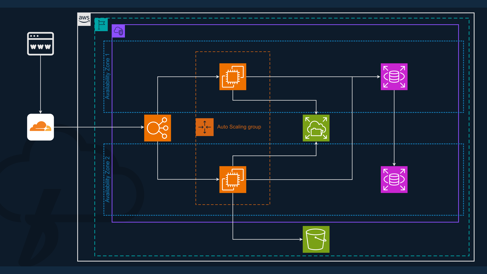

# Highly Available WordPress Deployment on AWS  

This repository contains all the files, configurations, and documentation for deploying a highly available WordPress application using AWS services like EC2, RDS, EFS, S3, and ELB.

## Features
- Multi-AZ setup for high availability.
- Elastic Load Balancer for traffic distribution.
- Auto Scaling Group for instance scaling.
- RDS (MySQL) for reliable database management.
- EFS for shared storage between EC2 instances.
- S3 for media storage.

## Repository Structure
- **Architecture**: Contains the architecture diagram of the project.
- **Documentation**: Detailed steps, project overview, and troubleshooting.
- **Configurations**: AWS setup configurations for key services.

## How It Works
1. Clients connect to the domain and are routed via an ELB.
2. ELB distributes traffic to EC2 instances across multiple availability zones.
3. EC2 instances connect to RDS for database management and EFS for shared storage.
4. Media files are offloaded to S3 for scalability and durability.

## Diagram

## Prerequisites
- AWS Account (Free Tier Compatible).
- Basic knowledge of AWS services.
- Domain (Optional but recommended).

## Next Steps
- Follow the deployment steps in the `Documentation` folder.
